# ZedBoard PS-PL Basic
會使用 Vivado 和 Xilinx SDK 做基本操作,並使用PS和PL通訊的AXI-GPIO,使開發板上的LED亮滅.

因為是基本操作,所以我把每個步驟都列出來,希望初學者可以更容易入門,所以會過於冗長,請各位見諒.

假如看不慣圖文的話,我也有做成影片,可以自己選擇看哪個.

不過兩種是不同時間點做的,會有一些小差異,不過大致上都是相同.

# Vivado 操作步驟
步驟 1

創建一個新的專案  

步驟 2

步驟 3

步驟 4
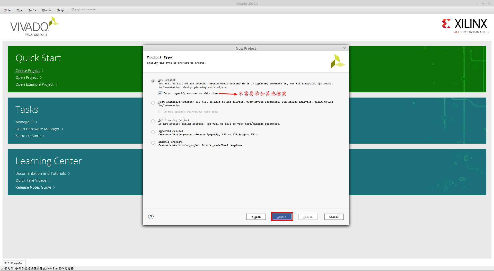

步驟 5
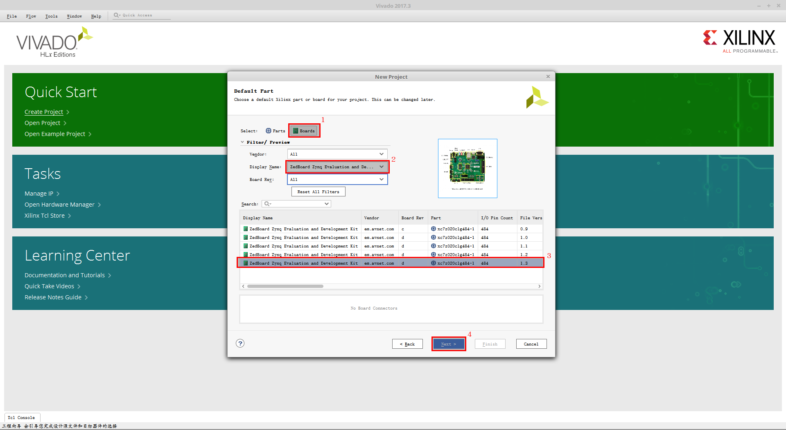

步驟 6
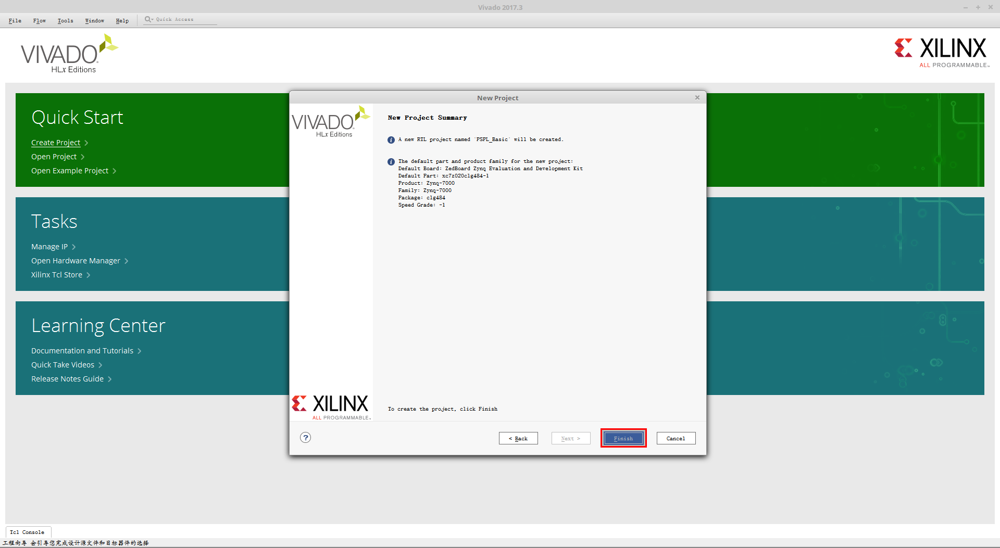

步驟 7
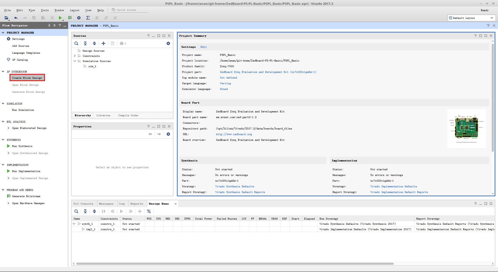

步驟 8
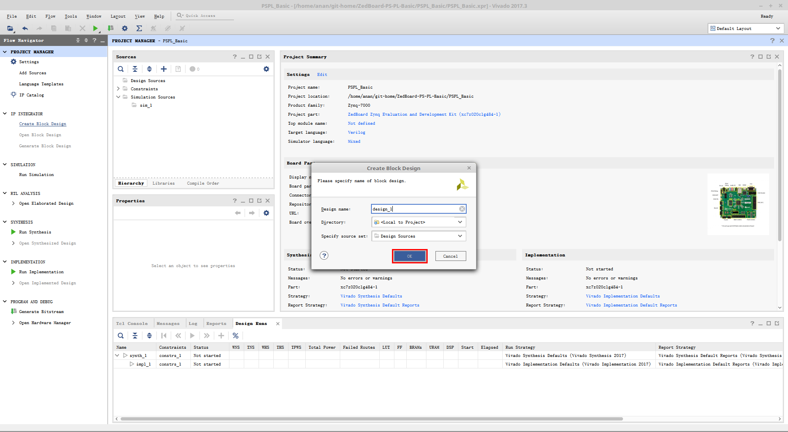

步驟 9
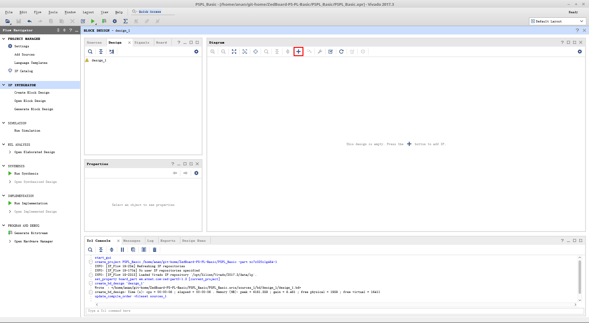

步驟 10
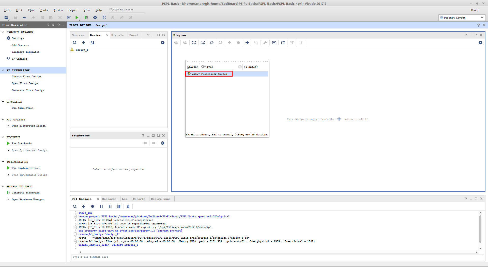

步驟 11
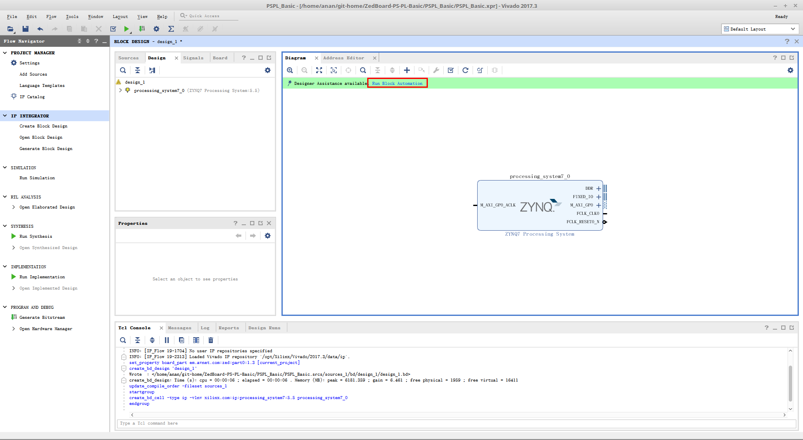

步驟 12
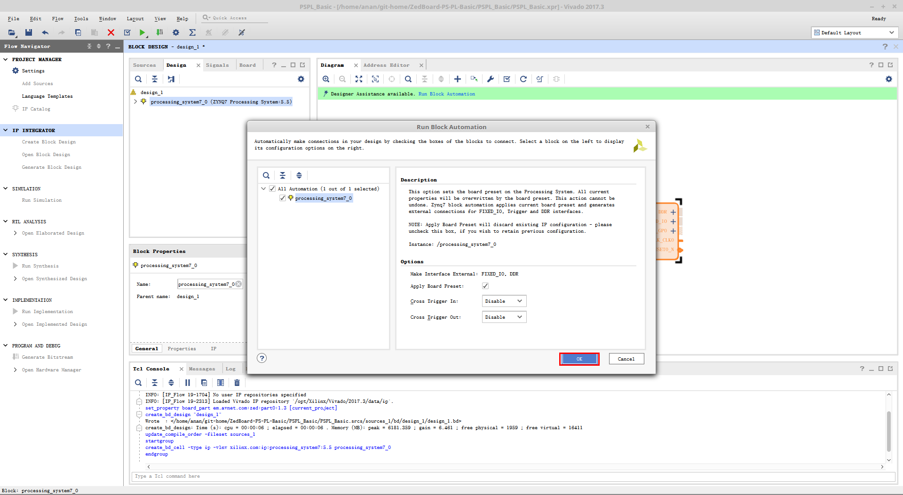

步驟 13

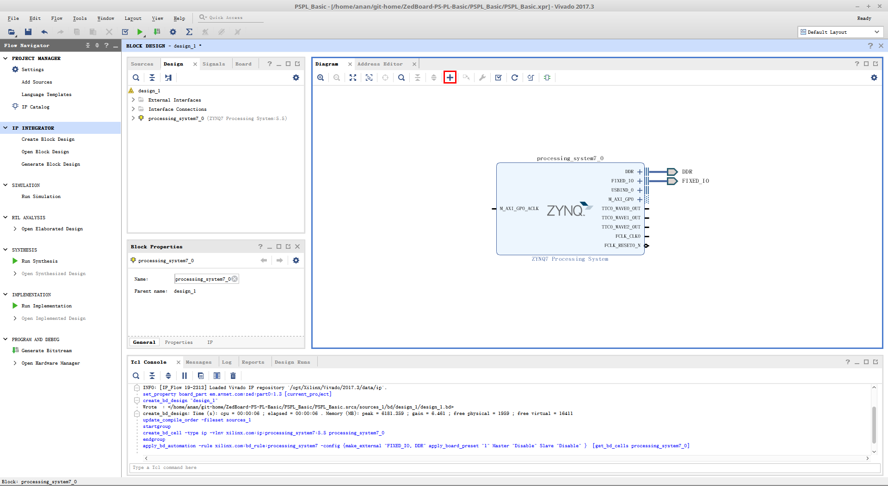

步驟 14
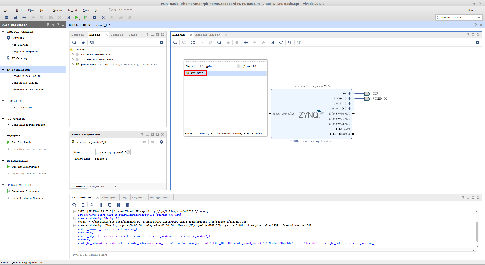

步驟 15
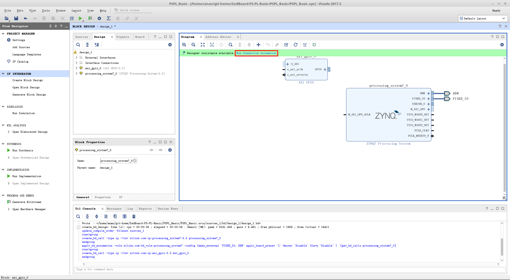

步驟 16
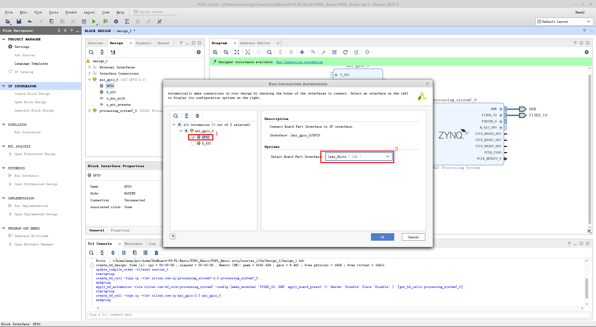

步驟 17
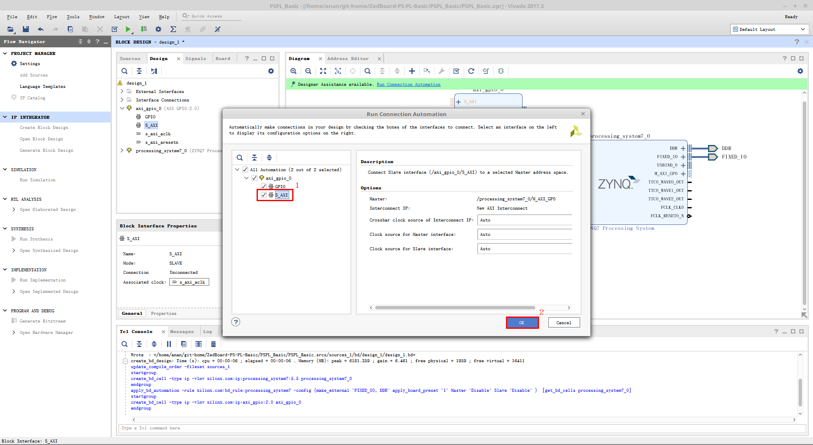

步驟 18
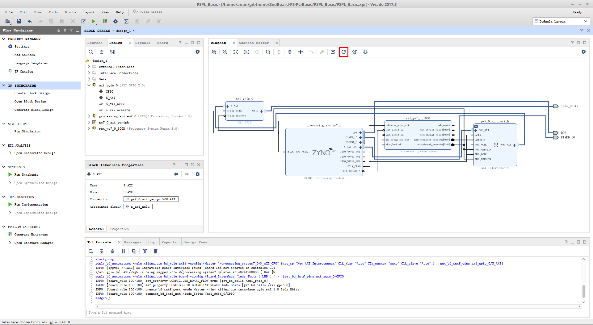

步驟 19
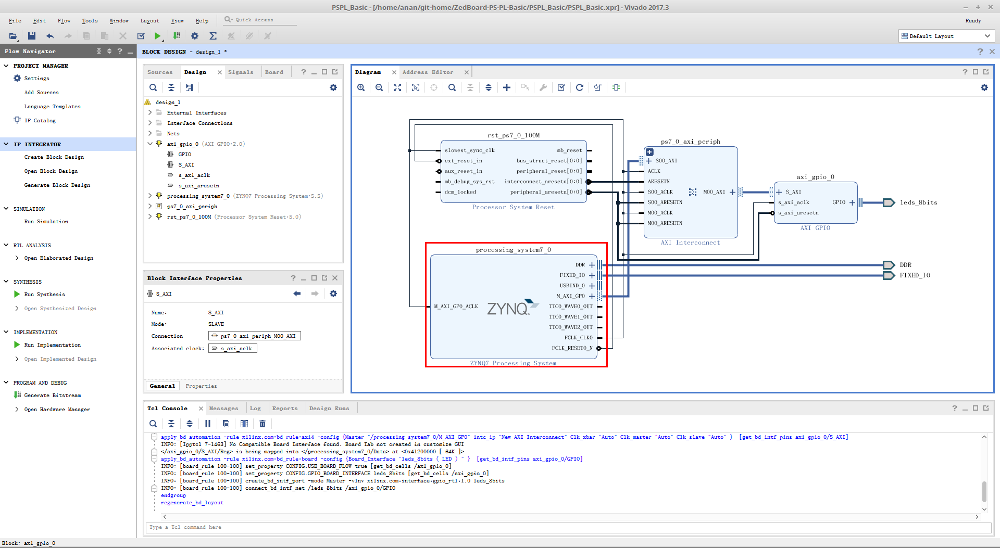

步驟 20
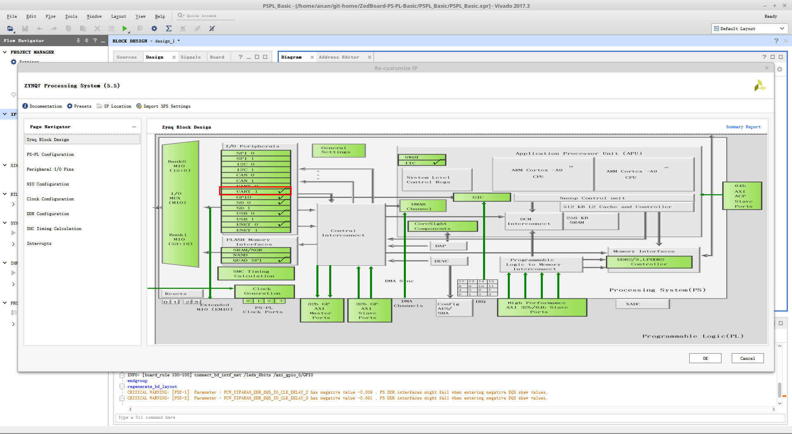

